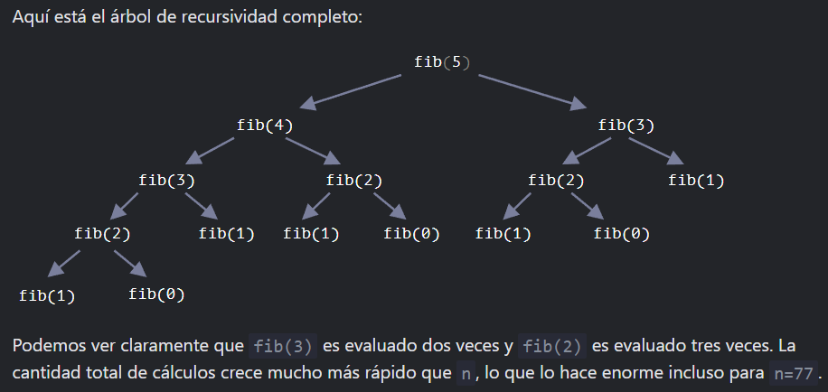

<style>
.red {
    color: red;
}

.blue {
    color: blue;
}
</style>

# <span class='blue'>Ejercicios recursividad con python</span>

## <span class='red'>Ejercicio 1</span>

 Implementar una función que permita obtener el valor en la sucesión de Fibonacci para un número dado

 ```python
 def fibonacci(n):
    if n == 0 or n == 1:
        return n
    return fibonacci(n-1) + fibonacci(n-2)

print(fibonacci(7))
 ```
 Este algoritmo es extremadamente lento, de hecho no intenten probarlo con un valor como 80 o estarán una eternidad esperando a que finalice.

 La razón de esta lentitud es la cantidad de veces que repetimos operaciones que ya hemos realizado, he encontrado un paper que
 lo explica por lo que les dejo esta bonita imagen de aca.

 

 Una forma de mejorarlo es hacerlo sin recursividad, si pensamos el problema de una forma distinta (Comenzando desde 1 e ir aumentando hasta llegar al valor ingresado en vez de comenzar desde el valor ingresado e ir disminuyendo hasta 1), podemos generar un algoritmo iterativo en el que sólo realizaremos cada cálculo 1 vez

 ```python
    
 def fibonacci2(n):
    if n == 0 or n == 1:
        return n
    a = 1
    b = 1
    for i in range(n-2): #n-2 porque los primeros 2 casos los tomamos en el if anterior
        a, b = b, a+b
    return b

 print(fibonacci2(80))
#--> 23416728348467685

 ```

## <span class='red'>Ejercicio 2 </span>
 
 Implementar una función que calcule la suma de todos los números enteros comprendidos entre cero y un número entero positivo dado.

 ```python
 def sumatoria(n):
    if n == 1:
        return n
    return n + sumatoria(n-1)

 print(sumatoria(100))
 # --> 5050
 ```